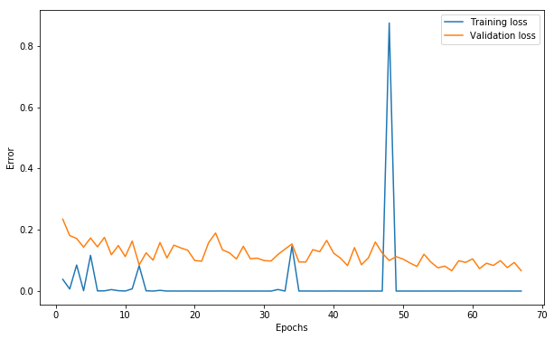

# German Traffic Sign Recognition Challenge using ResNets

This repository contains a simple, light and high accuracy model for the German Traffic Sign Recognition Benchmark ([GTSRB](http://benchmark.ini.rub.de/?section=gtsrb&subsection=dataset)) dataset. This model was designed and trained for the [NYU's Fall 2018 Computer Vision course competition in Kaggle](https://www.kaggle.com/c/nyu-cv-fall-2018). All training was done using GPUs in NYU's Prince cluster.

The baseline code for training and producing predictions was obtained [here](https://github.com/soumith/traffic-sign-detection-homework) and modified in this repository.

The Residual Network implemented in `model48.py` achieved **99.02%** accuracy as a single model in the test set of GTSRB. Although not being the record score on this dataset, this model can easily be trained in **under 10 minutes** in a single GPU. In its first epoch, it achieves already ~93% of accuracy in the validation set generated by `data48.py`.

(Please note: to proceed with training, please make sure you have PyTorch properly installed)

#### Training the model:
1. First download the dataset from [GTSRB](http://benchmark.ini.rub.de/?section=gtsrb&subsection=dataset)
2. Now run the following command:

```
python main48_cuda.py --data='<folder-with-data-zips>' --epochs=20 --batch-size=64 --lr=0.01 --wd=0.8 --momentum=0.9
```
(The code will unzip the dataset for you and create train/validation/test folders)

3. The code saves a checkpoint of the model after each training epoch as `model_##.pth` and runs it through the validation set, where you can see the validation accuracy. Also, it saves the training and validation losses per epoch in the file `losses.p`, to visualize it, run the following code:

```python
import pickle
import matplotlib.pyplot as plt

losses = pickle.load(open('dense_6-12-20-12_losses.p', 'rb'))

epochs = [e[0] for e in losses]
training_loss = [e[1] for e in losses]
val_loss = [e[2] for e in losses]

plt.plot(epochs, training_loss,  label="Training loss")
plt.plot(epochs, val_loss, label="Validation loss")
plt.xlabel("Epochs")
plt.ylabel("Error")
plt.legend()
plt.show()
```

Which will produce a graph like this:




#### Generating Predictions:
1. After selecting the saved checkpoint (e.g. `model_16.pth`) that you want to evaluate in the test set, run the following command:

```
python evaluate48_cuda.py --data='<folder-with-data-zips>' --model=<chosen-model.pth>
```

2. This will produce the file `gtsrb_kaggle.csv`, which contains the predictions of your model.
